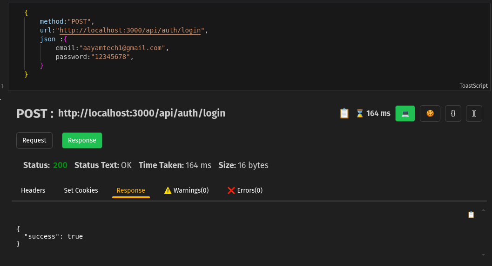
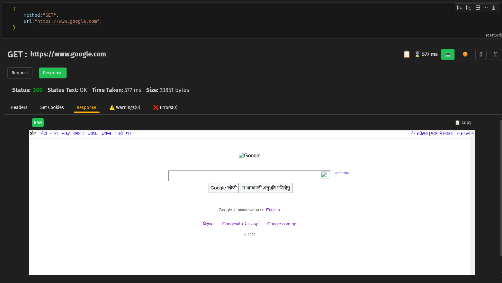
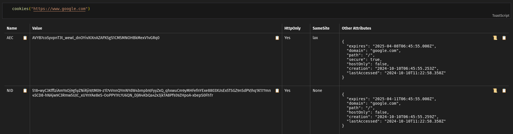
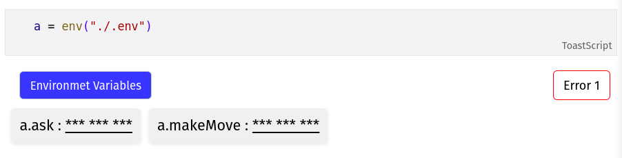
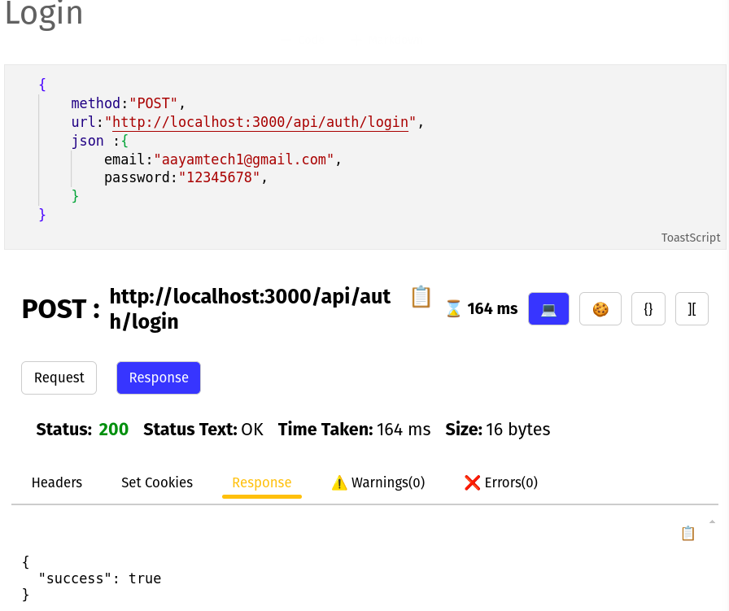
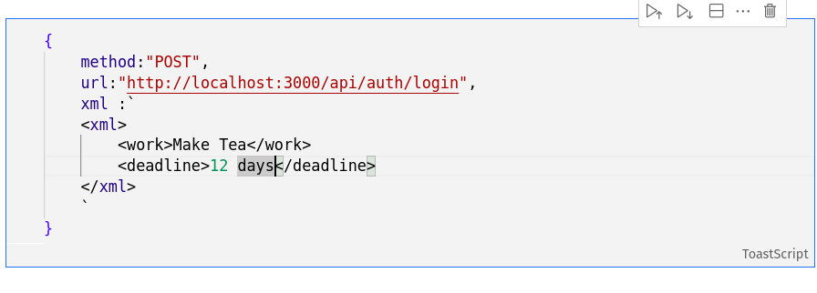
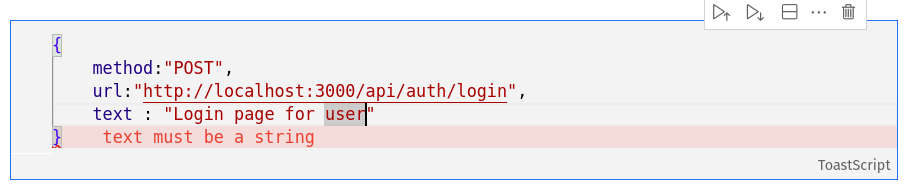
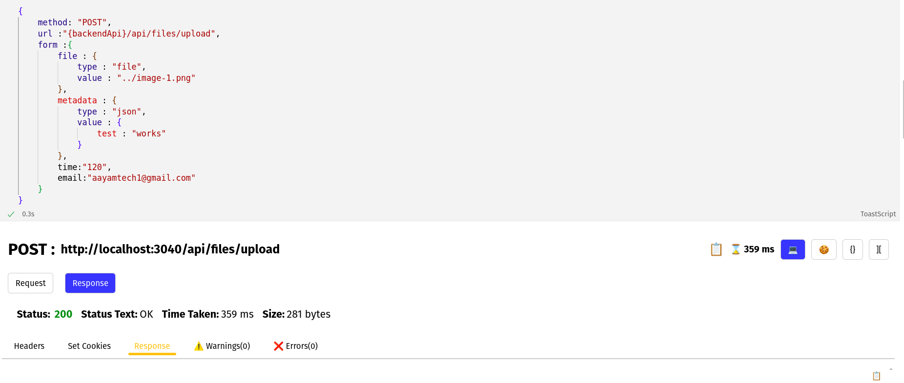
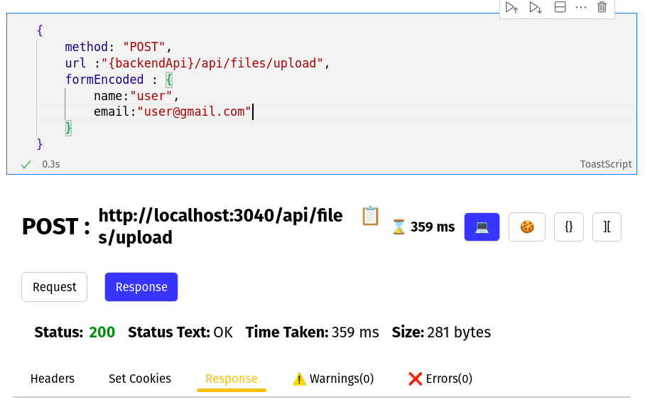
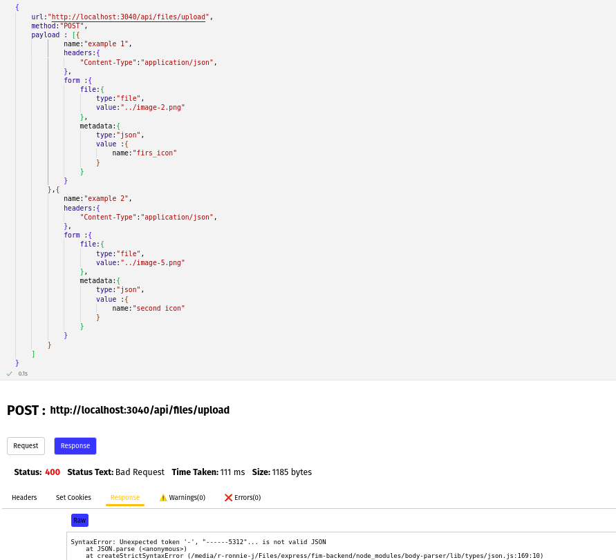

# Toast Book

- A **free alternative** to ThunderClient and Postman in VS Code  
- A **lightweight REST client**  

Toast Book is a lightweight REST API client that uses the powerful **VS Code Notebook API**, allowing you to test APIs seamlessly without the need for constant keyboard interaction.


## Quick Links
- [Screenshots](#screenshots)
- [Usage](#usage)
- [Examples](#examples)


## [Screenshots](#screenshots)

### POST request



### Get request


### Fetching Cookies 



---

## [Usage](#usage)

1. **Install** the extension from the **VS Code Marketplace**.
2. **Create a file** with the `.toast` extension.  
   - Example: `testAuthentication.toast`
3. There are **three types of commands** supported:  
   1. **Variable Assignment**  
   2. **Function Invocations**  
   3. **API Invocation**

> **⚠️ Warning:** Each notebook cell can contain **only one type** of command: either **variable assignment**, **env load**, or **API invocation**.

---

## [Examples](#examples)

## 1. Variable Assignment

Define variables to reuse throughout your notebook.

```javascript
backendAPI = "https://api.mochi.com"
noOfGuest = 12
```

You can use variable in by enclosing it in braces like  
 {backendUrl}  
 or  
 ${backendUrl}  

**For example**
```javascript
{
    url : "{backendUrl}/login",
    method:"POST",
    json:{
        no_of_guests = "${noOfGuest}",
        guests = {noOfGuest}
    }
}
```


## 2. Function Invocations

Toast Book provides built-in functions to support common tasks, such as **loading environment variables** and **fetching cookies**.

- **Fetching cookies:**

    ```javascript
    cookies("https://www.google.com")
    ```

    

- **Loading environment variables from a file:**

    ```javascript
    env("./env")
    ```
    **For example**
    

- **Storing environment variables in a variable:**

    ```javascript
    hereEnv = env("./simpleenv")
    ```

## 3. API Invocation

Toast Book supports various types of request bodies, such as **JSON**, **XML**, **Text**, **Form**, and **FormData**.  
⚠️ Use **only one type of body** per request.

Toast also supports **repeat requests**, where you specify how many times a certain request should be sent.  
Additionally, you can send **multiple requests in a payload** by providing them as an array.

#### Different Fields in API Invocation

- **method**:  
  Specifies the HTTP method to be used for the request. Supported methods include:  
  - `"GET"`  `"POST"` `"PUT"` `"PATCH"` `"DELETE"` and many more

  **Example**:  
  ```javascript
    method: "POST"
  ```

- **url**:  
  The endpoint where the server is hosted. This is the URL to which the request is sent.  
  **Example**:
  ```javascript
  url: "https://api.example.com/v1/resource"
  ```
- **headers**  
  A map of string key-value pairs representing the request headers.  

  **Example**:
  ```javascript
  headers: {
      'Content-Type': 'application/json',
      'Authorization': 'Bearer your_token_here'
  }
    ```

- **params**:  
  A map of string key-value pairs representing query parameters to be sent with the request.  
  **Example**:
  ```javascript
  params: {
      userId: "12345",
      includeDetails: "true"
  }
    ```

- **repeat:**  
    Number a time a request is send useful to check the server capacity and response time.

    ```javascript
    repeat : 12
    ```

- **json**:  
  The JSON body to be sent with the request. It must be in valid JSON format.  
  **Example**:
  ```javascript
  json: {
      email: "user@example.com",
      password: "securepassword"
  }
    ```

    **Screenshot**


    


- **xml**:  
  A string representing the XML body to be sent with the request. Enclose the XML string in backticks (`` ` ``).  
  **Example**:
  ```javascript
  xml: `
      <request>
          <email>user@example.com</email>
          <password>securepassword</password>
      </request>
  `
    ```

    **Screenshot**
    

- **text**:  
  An ordinary string to be sent as the body of the request. This can be enclosed in either double (`"`) or single (`'`) quotes.  
  **Example**:
  ```javascript
  text: "This is a plain text message."
    ```
    

- **form**:  
  Represents form data to be sent in the request. The form can contain simple key-value pairs. In the case of file uploads, XML, or JSON, you need to specify the data as an object where you define the type and value.  
  **Example**:
  ```javascript
  form: {
      username: "user",
      password: "password"
  }
  ```

  **Incase with json, xml and file**
  ```javascript
  form: {
    profile: {
        type: "file",
        value: "./icon.png"
    },
    description: "JohnDoe profile pic",
  }
  ```

  **Screenshots**

  

- **formEncoded**:  
  A map of string key-value pairs where the values can be of any type, typically used for file uploads or complex form submissions. For file uploads, you need to specify the type and value in a similar manner as in the form section.  

  **Example**:
  ```javascript
  formEncoded: {
      username: "user",
      password: "securepassword"
  }
  ```

  

- **payload**:  
  A list of requests, where each request can contain various fields such as `params`, `headers`, and the request body in `json`, `xml`, `text`, or `binary`. Each request in the payload should be structured as an object, allowing for multiple API requests to be sent in one go.

  **Example**:
  ```javascript
  payload: [
      {
          params: { userId: "123" },
          headers: { 'Authorization': 'Bearer token1' },
          json: { email: "user1@example.com", password: "securepassword" }
      },
      {
          params: { userId: "456" },
          headers: { 'Authorization': 'Bearer token2' },
          xml: `
              <user>
                  <email>user2@example.com</email>
                  <password>securepassword</password>
              </user>
          `
      },
      {
          params: { userId: "789" },
          headers: { 'Authorization': 'Bearer token3' },
          text: "This is a plain text message."
      }
    ]
     ```
    **Screenshot**
    

### Sending JSON

```javascript
{
    method: "POST",
    url: "http://localhost:3000/api/auth/signup",
    headers: {
        'Content-Type': 'application/json'
    },
    json: {
        email: "aayamtech1@gmail.com",
        password: "12345678",
        username: "aayam"
    }
}

```

### Sending XML

```javascript
{
    method: "POST",
    url: "http://localhost:3000/api/auth/signup",
    headers: {
        'Content-Type': 'application/xml'
    },
    xml: `
        <xml>
            <task>
                <detail>Buy milk</detail>
                <id>1</id>
            </task>
            <task>
                <detail>Buy bread</detail>
                <id>2</id>
            </task>
            <task>
                <detail>Make tea</detail>
                <id>3</id>
            </task>
        </xml>
    `
}
```

### Sending Text

```javascript
{
    method: "POST",
    url: "http://localhost:3000/api/auth/signup",
    headers: {
        'Content-Type': 'text/plain'
    },
    text: "This is a great place"
}
```

### Sending multiple request using payload

```javascript
{
    method: "POST",
    url: "http://localhost:3000/api/getProducts",
    headers: {
        'Content-Type': 'application/json'
    },
    payload: [
        {
            json: {
                email: "aayamtech1@gmail.com"
            },
            headers: {
                'Content-Type': 'application/json'
            },
            params: {
                page: 1,
                count: 12
            }
        },
        {
            json: {
                email: "aayamtech1@gmail.com"
            },
            headers: {
                'Content-Type': 'application/json'
            },
            params: {
                page: 2,
                count: 12
            }
        }
    ]
}
```
